## Introduction

The notion of HTTP/2 (hence this blog) started when I was trying to use gRPC, but to use protobufs and gRPC I had to understand HTTP/2 and to really appreciate HTTP/2, I had to validate what [IETF docs](https://www.rfc-editor.org/rfc/rfc9113) have to say. This blog is my own understanding of the flow as I could not find anything on the internet that shows real power of HTTP/2 other than [one](http://www.http2demo.io/) huge image that's been broken down to smaller image, and HTTP/2 outperforms HTTP/1.1 using request/response multiplexing.


## Why HTTP/2

HTTP/2 is successor of HTTP/1.1 and was developed to address the inefficiencies of it's predecessor. HTTP/1.1 was created when the internet was still in it's nascent stages and the webpages were mostly textual with very less volume of multimedia. But as the demand for more complex richer media and interactive element started to grow, HTTP/1.1 became slower and webdevs started having workarounds like

* Persistent Connection
* HTTP Pipelining : Multiple requests to same domain without waiting for the responses
* Domain Sharding
* Resource Concatenation

.. etc. Though these hacks were and still are working fine, google developed protocol [SPDY](https://www.chromium.org/spdy/) to overcome the shortcomings of HTTP/1.1 which later turned to HTTP/2

## HTTP/2 Solving Shortcomings of HTTP/1.1

Following on the question above, why HTTP/2 was developed, we need to look at some short comings of HTTP/1.1 and how HTTP/2 solves them.

#### Head-Of-Line-Blocking

**HTTP/1.1 Issue**

* In HTTP/1.1 reqeust and response are processed sequentially over one connection, i.e, when a connection is waiting or blocking (whatever the conditions are) no other data can be sent/received over the same connection. This can lead to head-of-line blocking. For ex: Chrome has maximum of 6 connections per domain, which means , at any time T, only 6 parallel connections are allowed, and if any of them is blocking, the performance is impacted.

**HTTP/2 Solution**

* HTTP/2 solves this by request response multiplexing. HTTP/2 (application layer protocol of the OSI model) breaks the response into streams and then attaches streamID for identification of the response, hence same TCP connection can now cater to multiple request responses by the concept of stream and multiplexing these streams in a same connection. This eliminates the head-of-line-blocking.


#### Text Based Protocol

**HTTP/1.1 Issue**

* HTTP/1.1 uses a text-based format, which is easy to read and debug but is less efficient for parsing and transmission.

**HTTP/2 Solution**

* HTTP/2 uses a binary protocol, which is more efficient for both parsing and transmission, reducing overhead and improving performance.

_What Exactly is Binary, Isnt everything Binary in the end, at Physical Layer of OSI?_

HTTP2 uses the binary protocol for serializing and deserializing the messages at the application layer, thus reducing size and enhancing processing.

#### Request and Response Headers Size

**HTTP/1.1 Issue**

* Browsers and clients often send huge amount of plain text data in the form of headers, leading to redundant information being sent repeatedly, which can be inefficient, especially for mobile and low-bandwidth connections. 

**HTTP/2 Solution**

* HTTP/2 uses HPACK header compression to reduce the size of headers. This significantly decreases the amount of data that needs to be transmitted, improving performance.

There are other enanchements that HTTP/2 brings over HTTP/1.1, but this doc only aims to validate some.


## Pointers before some tests

* Using JDK17, SpringBoot tomcat server with http2 enable
* HTTP/1.1 being tested over non TLS, as httpclient was not just working if multiple requests were sent over TLS, somehow the operations were too slow and appeared to be sequential even with threadpool.
* HTTP/2 being tested over TLS as HTTP/2 needs TLS handshake to be able to upgrade from HTTP1.1 to HTTP/2 via ALPN (Application Layer Protocol negotiation)
* HTTP2 can work over non TLS , the protocl is h2c but we'll be doing it over TLS
* Server is deployed as a docker container and the HTTP2 serves over self signed certs generated via keytool.
* tcpdump is used to check the number of connections from the client, at TCP layer a unique connection is identified as combination of source:port<->destination:port. As the server port is same, if we get unique port numbers from the source we can get the number of connections made. Lesser number of connection for same number of client requests implies Request Response multiplexing
* If we were to benchmark HTTP2(over TLS) vs HTTP/1.1(non TLS) over typical textual data, HTTP2 would be slower in some of the cases but do mind http2 is working over TLS
* httpclient(java.net.http) automatically upgrades to HTTP/2 if supported else falls back to HTTP/1.1, in this test the HTTP/2 is enabled and disabled by property in application.properties.
* The server is preloaded with some data but it's of no use as the HTTP/2 is not using protobuf an explicit binary framework for data processing.
* For our one final test, we are using python httpx with http2 to create browser like scenario of concurrency with limited client connection

**tcpdump hack**

I was also trying to see how many TLS handshake were actually happening, hence the following command that inspects the client hello. ```tcpdump -i any -n -nnn -s0 'tcp dst port 8444 and (tcp[((tcp[12] & 0xf0) >> 4) * 4] = 0x16)'```

## Testing if HTTP/2 Multiplexes

The first test is a simple test from httpclient which initiates 2 requests in parallel, the first one is blocked at the server with a larger delay and the other one is continued in the main thread but by introducing a delay of 1 second. Expectation here is that, for HTTP/1.1 the number of connections over non TLS would be 2 as it does not use multiplexing whereas for HTTP/2 there would only be one connection as it tries to uses same connection as much as possible by multiplexing

**HTTP/1.1 Test**

* Performing the same test for HTTP/1.1 first, and to do so we need to update the [application.properties](https://github.com/Gemini-Solutions/gemblog-codestub/blob/master/java-http2-server/src/main/resources/application.properties#L11) by commenting out the http2 enable flag and other TLS properties.
* Build the [docker image](https://github.com/Gemini-Solutions/gemblog-codestub/blob/master/java-http2-server/Dockerfile) and run it as ```docker run -tdi -p 8080:8080 http1-test```
* On the same server where docker container was just run, inspect the incoming request ```tcpdump -i any -n -nnn -s0 'tcp dst port 8080' > http1_connection```
* Get the [client](https://github.com/Gemini-Solutions/gemblog-codestub/tree/master/java-http2-client) locally & change the protocol to http and port to 8080 in [client as](https://github.com/Gemini-Solutions/gemblog-codestub/blob/master/java-http2-client/src/main/java/org/example/Http2ClientSimple.java#L18) and trigger the client requests.
* Get the unique number of TCP connections ```cat http2_connection | awk '{print $3, $5}' | sort | uniq | grep 10.50.16.16.8080 | wc -l```

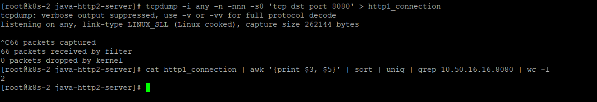


**HTTP/2 Test**

* Get the server ready by cloning the repo [here](https://github.com/Gemini-Solutions/gemblog-codestub/tree/master/java-http2-server)
* Build the Docker image and run it as ```docker run -tdi -p 8443:8443 http2-test```
* Let's inspect the incoming requests to port 8443 using tcpdump ```tcpdump -i any -n -nnn -s0 'tcp dst port 8443' > http2_connection```
* Initiate the client request from the [class](https://github.com/Gemini-Solutions/gemblog-codestub/blob/master/java-http2-client/src/main/java/org/example/Http2ClientSimple.java)
* Get the unique number of TCP connections ```cat http2_connection | awk '{print $3, $5}' | sort | uniq | grep 8444 | wc -l```

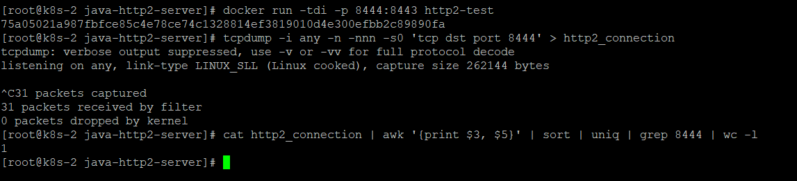


In this simple test, HTTP2 with TLS used same TCP connection with same client to have 2 req/response multiplexed whereas HTTP/1.1 created two separate TCP connections. Hence, HTTP/2 reduces head-of-line-blocking.

## Testing if HTTP/2 Multiplexes with multiple requests(80 VUS) K6

For this Test we are using [K6](https://k6.io/) to simulate the traffic from 80 virutal users (concurrent users) for 30seconds. Both HTTP/1.1 and HTTP2 would be over TLS.

* Remove the induced lag of 10s by commenting [sleep here](https://github.com/Gemini-Solutions/gemblog-codestub/blob/master/java-http2-server/src/main/java/org/example/EmployeeController.java#L56) and add lag anywhere in the 2-3 controllers like 0.5-2seconds.
* Build the docker image again for server accordingly for both HTTP1/2 by updating application.properties as did above.
* Get the K6 [script](https://github.com/Gemini-Solutions/gemblog-codestub/blob/master/java-http2-client/k6-test.js) and update the [host](https://github.com/Gemini-Solutions/gemblog-codestub/blob/master/java-http2-client/k6-test.js#L16) & [check](https://github.com/Gemini-Solutions/gemblog-codestub/blob/master/java-http2-client/k6-test.js#L19) for both HTTP types accordingly (as we did above) chaning protocol and port.
* Use command to run the K6 from within the docker as ```docker run --rm -v ${pwd}:/scripts loadimpact/k6 run --vus 80 --duration 30s --insecure-skip-tls-verify /scripts/k6-test.js```


**HTTP/1.1 Test**

Here's the http/1.1 test results from k6 with 80 virtual users (concurrent requests)

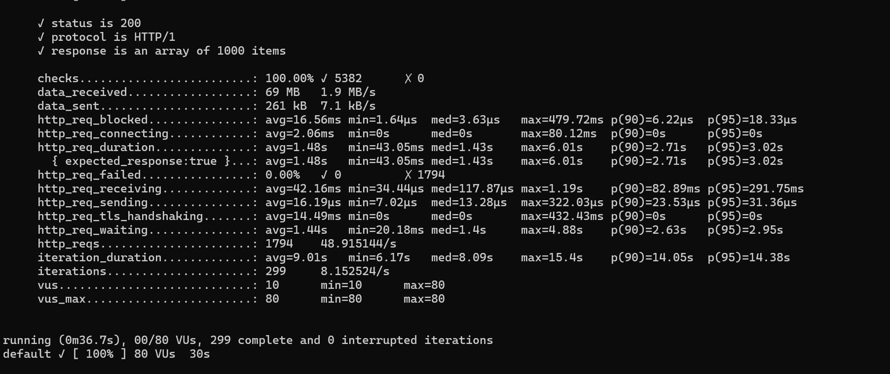

**HTTP/2 Test**

Here's the http/2 test results from k6 with 80 virtual users (concurrent requests)

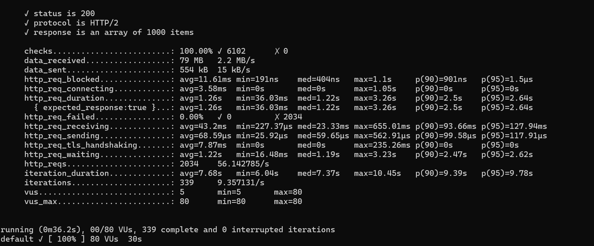


HTTP/2 outperforms HTTP/1.1 over TLS marginally , my hunch, this is primarily due to a performance gain in HTTP/2 by binary framing and header compression. If you were to check the numer of TCP connections for both the runs, you'd see the same number, the reason is, K6 achieves parallelism using virtual users i.e 80 while(true) loop in our case, which most probably wont be aware of other TPC connections that can be used. K6 is not really a suitable tool to check if it reuses the connection, as within 1VUS the reuqests are sequential and blocking


## Testing Performance & Multiplexed Connections with HttpClient

This test would try to benchmark the performance as well the req/resp multiplexing. The test would have HTTP/1.1 over non TLS (again the same issue, as httpclient just does not work, making it pathetically slow (aleast I could not do it easily)) and HTTP/2 over TLS. The server still has those induced latency from K6 script. At the client side we have httpclient which would submit 10k request with threadcount of 100. httpClient will automatically update to HTTP/2 if supported by server

* Update the application.properties for server for TLS and non TLS configuration as mentioned above and build both the docker images.
* Run the docker image for the server
* Initiate [client test](https://github.com/Gemini-Solutions/gemblog-codestub/blob/master/java-http2-client/src/main/java/org/example/Http2ClientTest.java) and update the host accordingly. Note that , this is a different class now that has multiple requests that could be fired off.
* Inspect TCP connections using tcpdump likewise.

### HTTP/1.1 Test

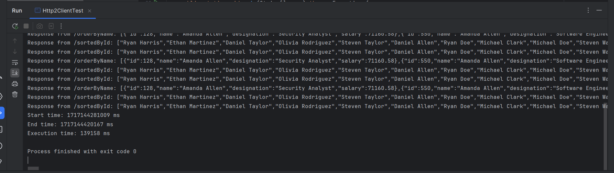

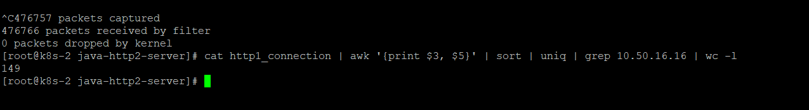


### HTTP/2 Test

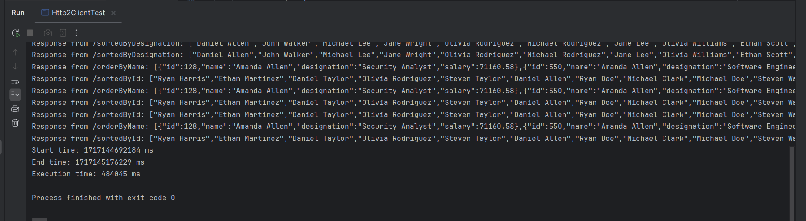

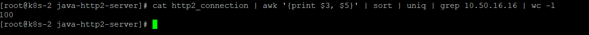

well, the results are clearly not what we expected, HTTP/2 is slower, and 3.5 times slower to that of HTTP/1.1 though HTTP/2 did multiplex and connection count is 33% less as compared to HTTP/1.1. But is it really the case? let's look at this closely. HTTP/1.1 was over non TLS whereas HTTP/2 was over TLS i.e for every connection it made there was a TLS handshake, network round trip to decide on encryption keys, encryption and decryption on both the ends etc. Let's have one more test for this with HTTP/1.1 over TLS and that too with only 120 RPS, i.e ~ 1% of what HTTP/2 server over TLS. Here are the results and we can clearly see the difference.


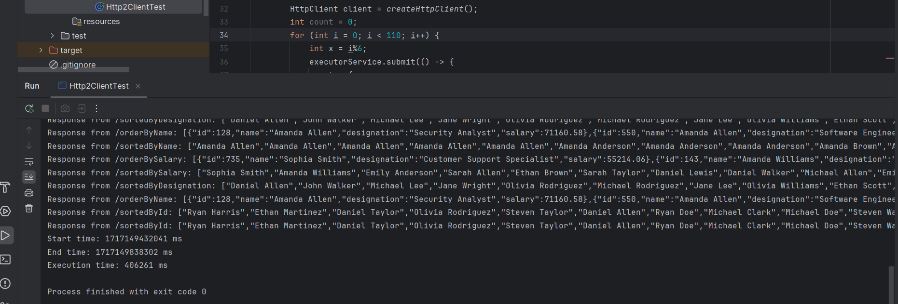


## One Final Big Test for Head-Of-Line-Blocking & Power of HTTP2

To test the real power of HTTP/2 we have to create an environment wherein the request response multiplexing can be leveraged, as in case of browsers where the parallel connections are limited to 6-8 per domain whereas the number of requests to render a multimedia page is often more than that, hence the HTTP/1.1 requests are blocked. But in case of HTTP/2 it often works seamlessly due to multiplexing. Same for our testing environment, we'll have to induce some latency in the server side (adding some delay to all the controllers) and limit the number of connections max to 6-10 but achieve async behaviour at client side either by parallelism or concurrency. Here's the setup

* Add the latency(sleep) to all the controllers(server) to add head-of-line-blocking like scenario.
* Build docker image accordingly for both HTTP1&2 and run the containers
* We are using python [async with http2](https://github.com/Gemini-Solutions/gemblog-codestub/blob/master/java-http2-client/python_httpx.py) for this test, as java httpclient was able to achieve parallelism but it was not restricting the number of connections being made to the server (even by adding ```-Djdk.httpclient.connectionPoolSize=1```), whereas this async approach limits the number of connections as well as, achieve [concurrency of number of times the the whole process](https://github.com/Gemini-Solutions/gemblog-codestub/blob/master/java-http2-client/python_httpx.py#L59) is run.
* Follow the similar steps, run container, inspect network packets, initiate test from local using the python client

### HTTP/1.1 Test

The below snapshot shows the time taken to have requests via HTTP/1.1 and the number of connections. Number of connections is ```MAX connection X No. times whole process run``` i.e 16 in our case.

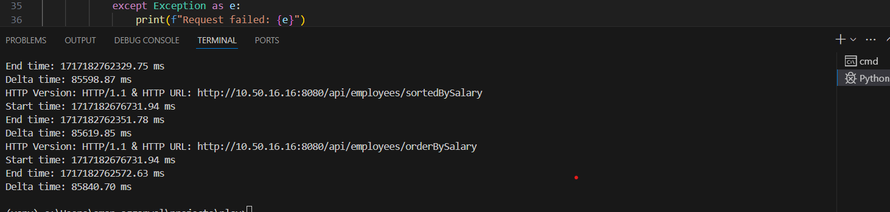


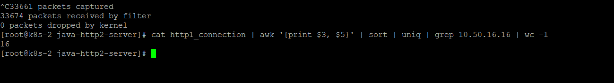


### HTTP/2 Test

The below snapshot shows the time taken to have requests via HTTP/2 and the number of connections. Number of connections is ```MAX connection X No. times whole process run``` i.e 4 in this case, as the client server multiplexes and enforce usage of streams.

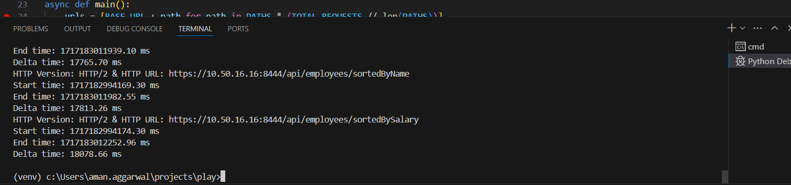


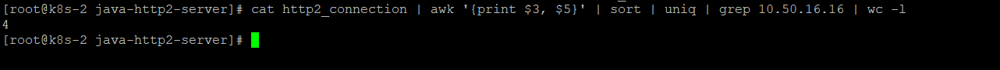


HTTP/2 outperforms HTTP/1 both in terms of throughput and having lesser number of connections.


## Concluding Thoughts

HTTP/2 is a great upgrade to HTTP/1 and it outperforms HTTP/1 in any scenario under browser like constraints i.e data transferred over TLS with a limit to number of connections client can initiate. HTTP/2 was designed for growing need of rich multimedia and varied req/response flow like server side push to reduce latency. H2 works out of the box as most of latest clients and servers are H2 compatible. It can really benefit if a binary serializer/deserializer like protobuf is added. gRPC with which, this whole blog was inspired, works seamlessly with HTTP/2 and a perfect candidate for machine to machine communication as it was designed to support binary protocol & HTTP2. gRPC is REST+HTTP/2 but on steroids :)...


## Is HTTP/2 Perfect?

* HTTP/2 still suffers from Head of line blocking, if the stream itself is blocked.
* What about proxies that poorly handle HTTP/2 as we saw with httpclient
* and some others ....

What if the smart people who developed, SPDY, use UDP's simplicity and less overhead for data processing & transfer, but at the same time achieve TCP's reliablity. Welcome to [HTTP/3](https://datatracker.ietf.org/doc/html/rfc9114) ......