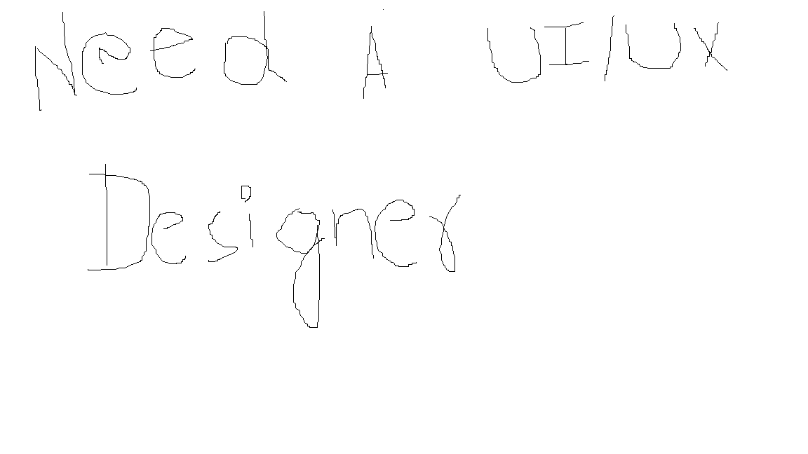

## Welcome

I'd be nourishing this page eventually as the number of blogs grow, for now, just the pointers on what's done & what's coming next.

- [x] AWS Passwordless Access using Webidentity
    * [x] [Using K8s API server as webidentity](/webidentiy-webhook-k8s-onprem)
    * [x] [Using external IDP as webidentity](/webidentiy-webhook-external-IDP)
    * [x] [AWS EKS with IRSA](/webidentity-IRSA-AWS-EKS)
    * [x] [Access from Local - Device flow](/webidentity-local-access-external-IDP)
- [x] Demystifying Service Mesh & Extending Security
    * [x] [What are Service Mesh & how it works](./service-mesh.md)
    * [x] [Extending Service Mesh for AuthN/AuthZ](./service-mesh-authN-authZ.md)
- [ ] Vector Databases
- [ ] Containers but without the runtime
    * [ ] Playing with namespaces, cgroups and seccomp profiles
- [ ] Redis pubsub architecture, eventloop and epoll()
- [ ] Many more :)

## Could use some help!!

## Would you like to be part of it?

I am going to start putting everything major I stumbled across in last couple of years and got me excited on how amazing people are doing even more amazing things. The objective of these blogs is to deep dive and see how everything fits.If you want to be part of it, you can subscribe to everything being posted in here, help review the docs, contribute or if you have anything in mind do share and we can collaborate.

