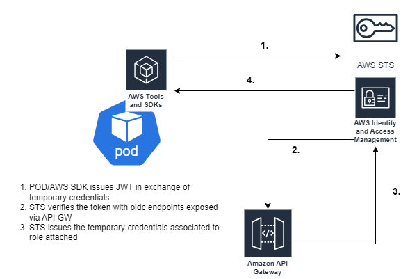
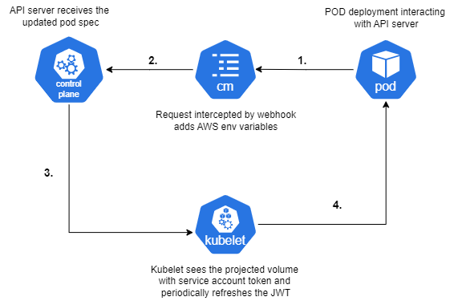

## Introduction

This blog is going to be a three part series on how to achieve passwordless (No AWS Secrets) access to AWS resources.
In the first(this) part we'll achieve the same using K8s API server as Identity provider, in [Second](/webidentiy-webhook-external-IDP) it would be using an external IDP like Azure and [Third](/webidentity-IRSA-AWS-EKS) would be AWS EKS using IRSA.

The guide requires readers to have understanding of [Kubernetes]("An orchestrator for your containerized workloads"), [JWT]("Base64 encoded payload that are signed by private key to prove the identity of the requester"), [Mutating Webhook]("Intercept the calls made to K8s API server") , AWS and [Identity Federation]("Entity authenticated from other source can access resources on other system through trust").

## What do we mean by passwordless access and how does it work?

Well obviously there has to be some sort of credential/identiy federation but not in plain text or AWS keys deployed as K8s secrets. 

We'll be leveraging AWS's webidentity, wherein the requester provides a token (JWT) and we configure AWS IAM to trust the issuer of that JWT. AWS webidentity works by trusting a federated user (**from K8s Api Server in our case**), and then the requester (SDK) assumes the role which has the _stsAssumerole_ action with least required permissions attached. AWS would then return temporary credentials to be used in subsequent calls.




```
{
    "Version": "2012-10-17",
    "Statement": [
        {
            "Effect": "Allow",
            "Principal": {
                "Federated": "The IDP we want to trust"
            },
            "Action": "sts:AssumeRoleWithWebIdentity",
            "Condition": {
                "StringEquals": {
                    "sts.windows.net/1122334455/:sub": "JWT-sub-claim",
                    "sts.windows.net/1122334455/:aud": "JWT-aud-claim"
                }
            }
        }
    ]
}
```


## How does the K8s POD get's this token?

Each pod in kubernets is associated to a service account and kubelet mounts a JWT token in POD's dir.
Now if you exec into the pod and see the contents of the token ```cat /var/secrets/kubernetes/serviceaccount.io/token``` and put it in [jwt.io](https://jwt.io), it would be default service account with around 1 year expiry. This is the default setup.
We'll leverage the same principal but tweak api server and our pod definition to give us an extra token that can be used with AWS.


### **_Enough of the definitions and Jargon, give me the instructions already!!!_**


## Grab K8s API Server OIDC Endpoints

In this section, we'll explore how to grab the OIDC endpoints from K8s server which would essentially be used in later stages by AWS to trust the token we issue.

* Clone the [repo](https://github.com/Gemini-Solutions/gemblog-codestub.git) and ``` cd webidentiy-webhook-k8s-onprem
/mutating_webhook``` to use the scripts and deployments.
* Exec into any running pod inside your k8s, and install curl and jq. Trust me this is the easiest way to grab the oidc details. 
* run [get_oidc_details.sh](https://github.com/Gemini-Solutions/gemblog-codestub/blob/master/webidentiy-webhook-k8s-onprem/mutating_webhook/get_oidc_details.sh) . The output would be needed in the next steps to put into API GW.
* It spews out the well known [open id configuration]("endpoint used by systems to grab the OIDC config") and the [JWKS URI]("Json representation of the public counterpart of the private key by which the token was signed").

## Making these endpoints Available to AWS

_How can AWS reach to the private endpoints which are not even routable outside of k8s cluster?_

Well, that's exactly what we want. **Only** the PODS deployed inside K8s server should be able to authenticate and grab the JWT from K8s private endpoints but at the same time we put the public endpoints (The JWKS and the openID configuration) in AWS for it to trust. There are multiple ways in doing so, like AWS API GW or AWS S3. In our example we'd be using AWS API GW. 

We'll NOT go into the details of setting up the API GW and it's stages but would quickly go over the important config/endpoints needed.

* Create the first endpoint as {API_GW_ROOT_URL}/.well-known/openid-configuration and the response as mock integration reponse grabbed from above which looks something like.

```
  {
  "issuer": "${API_GW_ROOT_URL}", // **Your issuer would be K8s private endpoint, replace it with API GW root URL**
  "jwks_uri": "https://10.10.10.10:6443/openid/v1/jwks",
  "response_types_supported": [
    "id_token"
  ],
  "subject_types_supported": [
    "public"
  ],
  "id_token_signing_alg_values_supported": [
    "RS256"
  ]
}
```

* Next is adding JWKS endpoint as , {API_GW_ROOT_URL}/openid/v1/jwks and having the mock response similar to from above.
```
{
  "keys": [
    {
      "use": "sig",
      "kty": "RSA",
      "kid": "H6hToWJ_o..somerandomkey",
      "alg": "RS256",
      "n": "1fIfCDehpXs4..randommodulous",
      "e": "something"
    }
  ]
}

```

NOTE: Ensure to deploy and test the API GW endpoints that they are accessible and give out expected response.

## Adding the newly created endpoints to API server

Now that we have created the OIDC endpoints in AWS API GW we can update our kube-api server to add the issuer {API_GW_ROOT_URL}
which is located at : /etc/kubernetes/manifests/kube-apiserver.yaml add ```- --service-account-issuer={API_GW_ROOT_URL}```. This would ensure that the issued token from the API server would now have AWS API GW as a trusted issuer and part of the JWT token.

NOTE: This has to be the first issuer for the whole setup to be working. This would make K8s API server trust tokens from both the issuers (AWS API GW and K8s api server itself) and also add this issuer to the JWT tokens.

**Before the update, Service Account JWT token**

```
{
  "aud":"https://kubernetes.default.svc.cluster.local",
  "exp": 1743960105,
  "iat": 1712424105,
  "iss": "https://kubernetes.default.svc.cluster.local",
  "kubernetes.io": {
    "namespace": "dev",
    "pod": {
      "name": "awesome-app",
      "uid": "c08d8cd1-7b20-409a-b73e-35b604026dad"
    }
  .
  .  
```

**After the update, Service Account JWT token**

```
{
  "aud": [
    "https://{API_GW_ROOT_URL}",
    "https://kubernetes.default.svc.cluster.local"
  ],
  "exp": 1743960105,
  "iat": 1712424105,
  "iss": "{API_GW_ROOT_URL}",
  "kubernetes.io": {
    "namespace": "dev",
    "pod": {
      "name": "awesome-app",
      "uid": "c08d8cd1-7b20-409a-b73e-35b604026dad"
    }
  .
  .  
```

*Notice the default service token now has the list of audience and the AWS API GW.*


## Deploying the mutating Webhook




Before we jump right into it let's have some breif intro to all the concepts we'd be using here

### *What is an admission controller in K8s?*

Admission controller are controllers that intecept the requests made to K8s API server and are of primarily 2 kinds, validating and mutating. Validating hooks are use to examin an incoming request and basis rules configured to allow or reject the request whereas the mutating webhook can patch the request as we want and can be used for init containers, side car injection or adding env vars.


### *What does our mutating webhook do?*

This mutating webhook, intercepts the request and makes 4 important patches

* ENV *AWS_ROLE_ARN* : This env variable's value is used by SDK to assume the role in AWS.
* ENV *AWS_WEB_IDENTITY_TOKEN_FILE* : The path to token file that would be used SDK to exchange temporary credentials
* Volume mount spec to the POD to access the token file
* Actual Volume of projected type with source: Serviceaccount , wherein kubelet would grab the token


```NOTE : You might have to add AWS_REGION as env variable and it's value as some SDKs give preference to env variables hence if they dont find the env variable for aws region, it would err out even if you have configured in you SDK while building the client.```


### *Understanding the code repo*

* [mutating_webhook.py](https://github.com/Gemini-Solutions/gemblog-codestub/blob/master/webidentiy-webhook-k8s-onprem/mutating_webhook/mutating_webhook.py): This is the actual logic of webhook that would intercept and patch the steps explained above.
* [mutating_webhook_config.yaml](https://github.com/Gemini-Solutions/gemblog-codestub/blob/master/webidentiy-webhook-k8s-onprem/mutating_webhook/mutating_webhook_config.yaml): The configuration for mutating webhook on which path the request should be POSTed to and the CA bunde. The communiation only happens over TLS.
* [generate_certs.sh](https://github.com/Gemini-Solutions/gemblog-codestub/blob/master/webidentiy-webhook-k8s-onprem/mutating_webhook/generate_cert.sh): Generates the TLS certs with server.key and server.crt and also spews out base64 encoded TLS bundle to be replaced (here)[https://github.com/Gemini-Solutions/gemblog-codestub/blob/master/webidentiy-webhook-k8s-onprem/mutating_webhook/mutating_webhook_config.yaml#L12].
* Create the image using Dockerfile, push to private registry and deploy all the config files(.yaml) to your cluster.

NOTE: The mutating_webhook_config.yaml indicates that the webhook would intercpt the POD creation request which have namespaces labeled as ```webidentity=enabled```


## Testing if everything works!!

It's a [flask app](https://github.com/Gemini-Solutions/gemblog-codestub/blob/master/webidentiy-webhook-k8s-onprem/test_app/app.py) that would try to grab the secrets from AWS secrets manager and return as response. It uses boto as sdk and as you can see it has no explicit config for secrets.

* Build the test app and push it to registry
* Label namespace ```kubectl create ns test && kubectl label namespace test webidentity=enabled --overwrite ```
* Deploy the app into the cluster.
* Create a secret in AWS with name ```irsa/onprem/test```

firstly, let's inspect the contents of pod spec to see if mutating webhook injected the required values ```kubectl get pods <pod-name> -ntest -oyaml```. Voila!! webhook has added the required env vars and volume, moreover the AWS_WEB_IDENTITY_TOKEN_FILE contains the token file.

```
      env:
      - name: AWS_ROLE_ARN
        value: arn:aws:iam::1122334455:role/ubuntu-test-onprem-webidentity-role
      - name: AWS_WEB_IDENTITY_TOKEN_FILE
        value: /home/web_identity_token/token
      image: my-test-app
      imagePullPolicy: Always
      name: ubuntu-container
      volumeMounts:
      - mountPath: /var/run/secrets/kubernetes.io/serviceaccount
        name: kube-api-access-4tlsm
        readOnly: true
      - mountPath: /home/web_identity_token
        name: web-identity-token
```

Accessing the endpoint to get the secrets

```kubectl port-forward pod-name 5000:5000 -ntest``` & ```curl localhost:5000/ping```

Duhhhh!!! It does not work :sob: but it's expected. We neither have created an associated role as mentioned in AWS_ROLE_ARN nor our AWS IAM still has the configuration to trust the token being issued. 

Before making changes in AWS, let's revisit what our webhook does for each pod is added to the cluster

* It adds the Role arn of the format ```pod_name + "-" + name_space + "-onprem-webidentity-role"```
* and request token with audience claim ```service_account_name + '.' + pod_name + '.' + name_space```

## Adding Identity Provider and Role for the POD

We have to create an entry inside the AWS to trust the token from an identity provider and audience list in our case which would be {API_GW_ROOT_URL} and list of audiences to trust

* Go to IAM -> Identity Providers -> Add Proivder -> OpenID Connect and add {API_GW_ROOT_URL} 
* Add Audience : It has to be same what webhook issues ```service_account_name + '.' + pod_name + '.' + name_space```, hit add provider
* Create IAM role : Add the IAM role -> custom trust policy as : 
```
{
    "Version": "2012-10-17",
    "Statement": [
        {
            "Effect": "Allow",
            "Principal": {
                "Federated": "arn:aws:iam::11223344:oidc-provider/API_GW_ROOT_URL"
            },
            "Action": "sts:AssumeRoleWithWebIdentity",
            "Condition": {
                "StringEquals": {
                    "API_GW_ROOT_URL/prod:aud": "Pod-Audience" //service_account_name + '.' + pod_name + '.' + name_space
                }
            }
        }
    ]
}
```
and name ```pod_name + "-" + name_space + -onprem-webidentity-role``` ex: pod-test-onprem-webidentity-role and add the following trust policy and add the permissions only which are required, in our case *secretsmanager:READ*


One last try to see if everything works, back to localhost ```curl localhost:5000/ping```

And, We have our Secret! :simple-happycow:


## Summarizing the action

Webhook intercepted the request, added the required env  (AWS_ROLE_ARN & AWS_WEB_IDENTITY_TOKEN_FILE). Kubelet would automatically refresh the custom token every 50 minutes or so as our token's expiry is 60 minutes. Once the request to AWS fails or it return unauthenticated, the SDK automatically reloads the token from the file and request new set of temporary tokens from AWS by assuming role and the cycle follows. The issuer as API GW was added to both the IAM and the K8s api server.


## Enhancements & Next Steps

We can automate the process of role creation with our mutating_webhook.py which essentially would require the secrets or any other outbond job to do th same.
Next in line we have a short walkthrough on how it can be achieved using an external IDP wherein we wont be able to leverage kubelet to refresh the tokens for us, we'll have to periodically refresh the token using side car.
